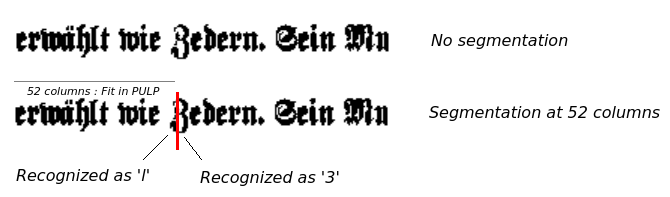
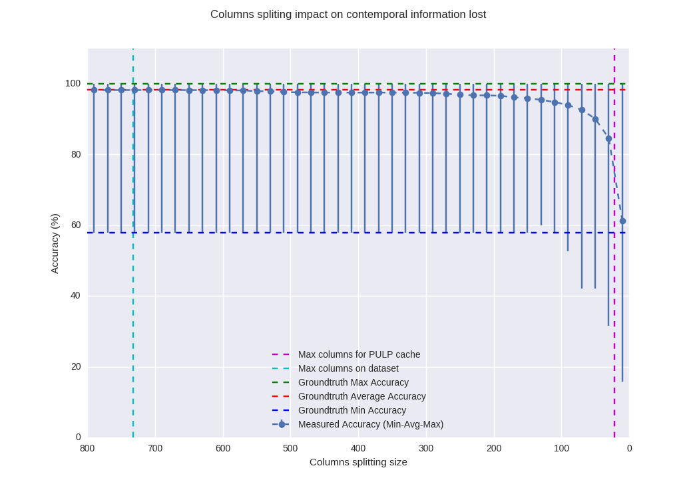

# kW BLSTM Demonstrator

This is the source code for the kW demonstrator for the blstm mb. It includes the host code software and the software for PULP. The code is organized in three main directories, while every directory contains two subdirectories, i.e. `src` and `include`, holding the source and header files respectively.

- **host:** The application code part running on host (POWER8): Reading of input image files stored on disk, preparing of WED struct, feeding of image data to PULP with DMA, reading of results from PULP, accuracy comparison with groundtruth.  
- **pulp:** The application code part running on PULP. The complete functionality of blstm mb has been ported to PULP: reading of input image from CAPI WED, processing of image, results forwarding to host.
- **common:** The place of common code for the two subsystems (host & pulp). It includes a header file with i) application parameters, ii) compilation parameters and iii) runtime parameters.


Use `make run` in to build the host and PULP binaries, and run then in the virtual platform. See the Makefiles for details.

The application assumes that the input and groundtruth data are located on `<project_path>/mb/data/prepared/mb/blstm`. Please adapt the path in [host.cpp](./host/src/host.cpp) accordingly.

## Notes
Some initial observations from the BLSTM kW demonstrator. Please contact me for any thoughts on the following points (Dionysios Diamantopoulos, <did@zurich.ibm.com>).

### BLSTM POWER-PULP co-design
A straightforward partition scheme has been applied, keeping the overall computation load to PULP (for energy  efficiency) and leaving the data feeding (image) and results storing to POWER host. The algorithm reads an input image once, and then it is working on a memory chunk with a uniform access pattern, i.e. it is repeatably revisits this memory by applying operations over 7-arrays weighting factors. A co-design solution that partitions the algorithm wherever inside the BLSTM algorithm, would imply that intermediate data should be exchanged between POWER and PULP, incurring communication latency.

Since the aforementioned approach suffers from memory shortage on PULP ([see Memory requirements ](#memory-requirements)), we may come up with alternative architectures approaches, i.e. :
- **Hidden Layer only on PULP:** The hidden layer holds the 90% of the total execution time. It may be ported to PULP, and the rest of the algorithm may stay on POWER. Since, two hidden layers are computed (for forward and backward image), they may be mapped to two PULP cores, within the same cluster.
- **Partition algorithm to clusters:** Using different clusters to map parts of the algorithm, will allow to use their separate stack (for weights) and heap (for intermediate results). Since three distinct sub-functions, with no data dependencies, can be mapped to different clusters, we may increase the number of columns we can load to PULP.
- **FPGA co-processor:** A parallel activity is running on this approach. The BLSTM has been mapped to an AXI-compliant FPGA accelerator. The accelearor introduces custom fixed-point datatype format delivering promising execution speedup and energy footprint. The accelerator has been tested on CAPI-POWER. Attaching the accelerator or "part" of this accelerator to PULP is an ongoing activity.

### Memory requirements
Currently the PULP system does not have the memory space to store and process a complete image. The size of every image is dependent to the number of vertical columns. The images in the dataset have 64 to 732 columns. An image with COLS columns has `COLS x 25 pixels x 4 bytes (float)` space requirements. For the processing of a single image the following extra memory requirements apply:
* `COLS x 25 pixels x 4 bytes` for storing the backward image
* `COLS x 100 neurons x 4 bytes` for storing the output of forward layer
* `COLS x 100 neurons x 4 bytes` for storing the output of backward layer
* `COLS x 110 classes x 4 bytes` for storing the output of output layer
* `COLS x 4 bytes` for storing the output indexers to the alphabet (maximum value when a single column equals to a single character, practically more than 3-4 columns contribute to a character reconstruction.)
* `60310 x 2 x 4 bytes` for storing the weighting factors

Since the weighting factors are static variables we can store them in stack (to leave more space in heap). Then, the total runtime space requirements are `COLS x 361 x 4 bytes`. We have applied a memory optimization that free up the elements that no longer are required, e.g. the input forward image after processing the forward layer. This refactoring reduces the requirements to `COLS x 311 x 4 bytes`. Thus, for an image of 732 columns (the maximum number of columns for the images on mb's dataset) we decrease the memory requirements from 1.057.008 to 910.608 bytes.

However, the PULP system offers less memory than that. In addition, some extra memory is required for storing the CAPI-WED and the local buffer for receiving data from host and forwarding results back (though this buffer may be kept low).

The following quick snippet reports the maximum heap memory for dynamic allocation at `51136 bytes` (slightly less than `64KB`).

```C
unsigned int b = 0;
while (rt_alloc(RT_ALLOC_CL_DATA,(1*sizeof(uint64_t))) != NULL)
  ++b;
printf("Allocated %d bytes total\n", b*sizeof(uint64_t));
exit(ERROR_PULP_OUT_OF_MEM);
```

:grey_question: If in the previous snippet we change the `uint64_t` to `uint32_t` then the reported number is `25568`, i.e. half the `51136`. Thus it seems that the allocator of the 32-bit RISC processor is aligned to 8 bytes. Essentially, `x words of uint64_t` reserve the same space in heap with `x words of uint32_t`. Can we verify this? (it makes sense of 8-bit and 16-bit variables to be aligned to 32-bit memory chunks, since this is the addressable space for 32-bit, but why we loose half the space with `uint32_t or float` ?).

We have come up with a solution that splits the image to several segments that fit into the available memory. However this approach suffers from accuracy degradation, since the points of segmentation are destroying sensitive visual information. An illustration of this problem is depicted in the following image.



 The higher segmentation rate, the more segmentation points, leading to lower accuracy. The following image reflects the accuracy degradation for different number of columns. Please note that these results are for the complete mb's dataset, showing the minimum, average and maximum accuracy achieved for every image segmentation ratio.



We have also tried to store some of the arrays to the stack, i.e. static allocation instead of dynamic allocation on heap. This allowed us to segment images up to 44 columns (instead of 21 columns with allocation only in heap). However this approach is not recommended,since there is no exact method for identifying how much memory is available in stack at a specific execution timing window, which implies that memory corruption may happen with no traceable debug information (e.g. we have reached 44 columns with try-&-error test.)

### Math.h functions

Since there is no support for the the stdlib math.h library on PULP, we are using two methods:
- **Mathematical approximation of expf():** The approach has been derived from _N. N. Schraudolph, A Fast, Compact Approximation of the Exponential Function," in Neural Computation, 1999_. See the [tiny_math.h](./pulp/include/tiny_math.h) library.
- **Look-up-tables for expf() and tanh():** We are constructing look-up tables tailored to the dynamic range needed by BLSTM (after detailed profiling). See [lut.h](./pulp/include/lut.h).

Both methods have been tested for the BLSTM mb over the complete dataset and they have negligible accuracy impact (<1%). _However this analysis is a running activity, other techniques may apply_.  


### Debugging BLSTM on PULP
By definition, it's not as handy as debugging host code on a host environment.

:boom: printf()'s framebuffer has issues, e.g. no float numbers can be printed on screen. Instead, I use the following snippet to print the hex value of a float number:

```C
float pi=3.14;
union {
	uint32_t t;
	float f;
	} u;
u.f = pi;
printf("pi=%08lx\n", (uint32_t)u.t); // take care not to use %08x, but %08lx !
```
:boom: Illegal PULP instruction at address 0xXXXXX..XX: When hitting this error, probably a missing instruction opcode has reached the instruction fetch unit of PULP SDK. HINT: try to follow the KISS philosophy, i.e. refactor the code to basic operations per line. For instance, the following code throws an exception. Refactoring to simple operations generates basic risc instructions which are implemented on PULP SDK.
```C
float tmp1=1f, tmp2=2f, tmp3=3f;
tmp1 /= (tmp2++) * (tmp3--); // unsupported divide-accumulate instruction
```
:boom: No memory leak detection tools exist on PULP SDK runtime. To resolve any possible leaks, I firstly ensure that the code running on PULP, is memory-leak free, by executing it as a standalone unit on my x86 host and ckeck the binary with gdb, valgrind, ... debugging tools. However, this approach does not cover potential memory leaks on WED's buffer reading/writing. Maybe mapping gdb to CAPI MMIO ?(somehow...)

:boom: Accuracy of computations. I've noticed some mismatches for floating point processing on PULP vs x86. Below is an example for multiplication.

| | Operand 1 | Operand 2 | Result |
| ------ | -------- | -------- | ----- |
| **x86** </br>dec</br>hex  | </br>2.622684001922</br>0x4027da0e | </br>0.082091897726</br>0x3da81fcc | </br>0.215301`111340`</br>0x3e5c77e`5` |
| **PULP** </br>dec</br>hex    | </br>2.622684001922</br>0x4027da0e | </br>0.082091897726</br>0x3da81fcc | </br>0.215301`096439`</br>0x3e5c77e`4` |

For a lot of multiplication and division results there is a mismatch on the last digit (not for all though). This error may be accumulated and lead to algorithm mismatches when comparing solutions on PULP and x86. For the BLSTM case, such errors lead to a lot of mismatches, which however have small impact on final accuracy. But still, debugging is getting more difficult when comparing PULP-x86 hex values at specific points of algorithms execution. It would be nice if we can have a hint from PULP partners for this issue, so that we can either resolve it on PULP SDK or reproduce it on x86, in order to have identical computation results.


### Next steps
The blstm demonstrator has been tested on POWER8 instance with PULP SDK, available on ZHC2 cloud (pulp_sdk_v4). In order to continuing the development and apply optimizations so that the accuracy will be improved, we may apply parallel processing among cores-clusters so that memory requirements are relaxed. To get there, a number of exemplary templates (samples on repo) extending the SDK will be valuable:

- [ ] Inter-core (same cluster) processing: offload two functions on different cores of same cluster
- [ ] Inter-cluster processing: offload two functions on different cores of different clusters
- [ ] Barriers (parallel processing): synchronize two functions
- [ ] PULP performance metrics collection (estimate exec. time): currently the use of rt\_perf functions does not return any cycles number.
